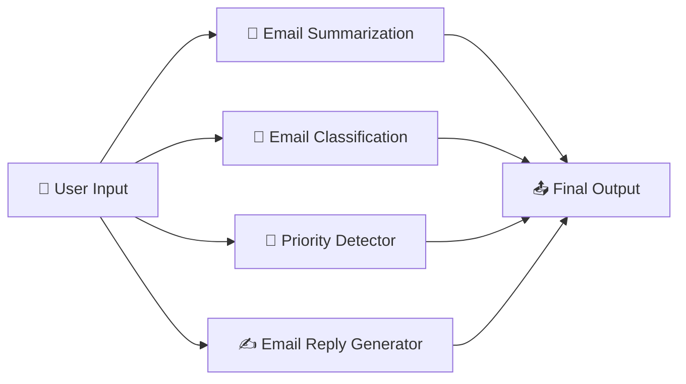

# 📧 MailMind AI

**AI-Powered Email Summarization using Dify & Generative AI**

MailMind AI is an AI-powered workflow built using **Dify** that analyzes email subject and content and generates a structured summary with important information, action items, and deadlines.

---

## 🔄 Workflow




# 🎯 Objectives
📧 Simplify email reading and understanding
🤖 Automate email summarization
📌 Extract important information
✅ Identify required actions
⏰ Detect deadlines
🧠 Demonstrate prompt engineering
⚙️ Build a practical AI workflow using Dify
✨ Features
📧 Email Input

## Accepts:

Email Subject
Email Content

## 🧠 AI Summarization
Generates a concise summary while preserving important information.

## 📌 Important Point Extraction
Identifies the key information from the email.

## ✅ Action Item Detection
Extracts tasks that need to be completed.

## ⏰ Deadline Detection
Identifies dates, times, and deadlines mentioned in the email.

If no deadline is found, the workflow returns:

Not specified

# ⚙️ How It Works
- User enters the email subject.
- User enters the email content.
- Inputs are passed to the Dify workflow.
- The AI analyzes the email.
- Important information is extracted.
- Actions and deadlines are identified.
- A structured summary is generated.
# Project Structure
```text
MailMind-AI/
│
├── README.md
│
└── screenshots/
    └── workflow.png
    └── Output.png 
```
# 📋 Output
The workflow generates:

## Short Summary:
A concise summary of the email.

Important Points:
- Key information
- Important details

Action Items:
- Tasks that need to be completed

Deadlines:
- Relevant dates or times
- Not specified if no deadline exists

# 🛠️ Technologies

# # Technology	Purpose
Dify	AI workflow development
Generative AI / LLM	Email analysis
Prompt Engineering	Controlling AI output
Dify Variables	Passing email inputs
Workflow Automation	Automating email processing

# 💡 Use Cases

- 📧 Summarizing long emails
- 🏢 Workplace communication
- 🎓 Student communications
- 📅 Meeting announcements
- ✅ Task extraction
- ⏰ Deadline identification
- 📢 Important announcements

 # 🔮 Future Improvements
 
- 📧 Direct email integration
- 🚨 Urgent email detection
- 📊 Email priority classification
- 📅 Calendar integration
- 🔔 Deadline reminders
- 🏷️ Email category classification
- 🌐 Multilingual summarization
- ✍️ AI-generated email replies
- 📈 Email analytics

  # 📚 Learning Outcomes

This project demonstrates:

- Generative AI
- Prompt Engineering
- Dify Workflows
- LLM-based Text Summarization
- Information Extraction
- Workflow Automation
- Structured AI Output
- Human-AI Interaction

# 👨‍💻 Author

## Srudhya S

A Generative AI project exploring Dify Workflow Automation, Prompt Engineering, and AI-powered Email Summarization.
